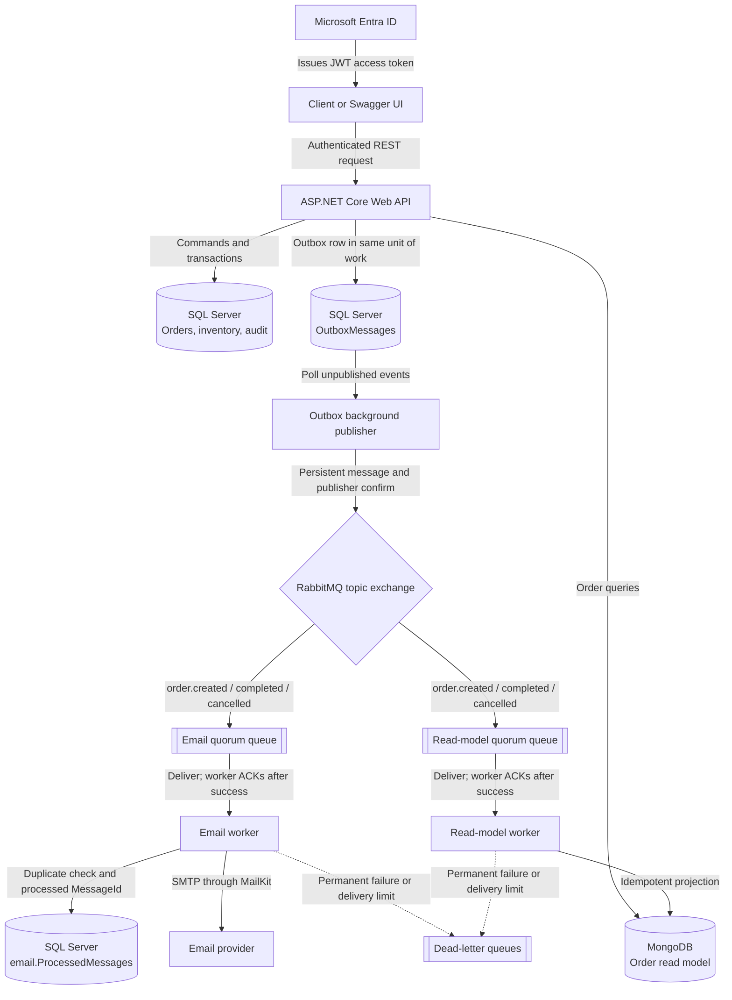

# Order Processing Platform API

[](https://github.com/PetkovskiM/order-processing-platform-api/actions/workflows/ci.yml)

A production-style order-processing backend built with .NET 10. The project goes beyond CRUD to demonstrate transactional business workflows, CQRS, reliable asynchronous messaging, a MongoDB read model, Microsoft Entra ID security, automated testing, and continuous integration.

The system manages customers, products, inventory, and order lifecycles. SQL Server is the source of truth for writes, while order queries are served from an asynchronously maintained MongoDB read model.

## Highlights

- RESTful ASP.NET Core API with DTO validation and consistent `ProblemDetails` errors
- Transactional order creation, inventory updates, audit records, and outbox messages
- CQRS-style order commands and queries implemented with MediatR
- Transactional outbox publisher with retry tracking and RabbitMQ publisher confirms
- Durable RabbitMQ topic exchange, quorum queues, manual acknowledgements, delayed retries, and dead-letter queues
- Separate email and read-model worker processes
- Idempotent email consumption backed by a SQL inbox table
- MongoDB order projections with filtering, sorting, pagination, indexes, and stale-event protection
- JWT bearer authentication with Microsoft Entra ID
- Scope- and role-based authorization policies for read and write access
- OAuth 2.0 Authorization Code flow with PKCE in Swagger UI
- Unit and integration tests with xUnit, `WebApplicationFactory`, and SQLite in-memory databases
- GitHub Actions CI for restore, build, test, and test-result publishing

## Architecture



### Write and event flow

1. The API validates the authenticated request and executes an order command through MediatR.
2. EF Core updates the order, inventory, and audit data in SQL Server.
3. The corresponding integration event is stored in `OutboxMessages` as part of the same database unit of work.
4. `OutboxBackgroundService` polls pending messages and publishes them to the RabbitMQ topic exchange.
5. RabbitMQ routes each event independently to the email and read-model queues.
6. Workers acknowledge messages only after successful processing. Permanent failures are dead-lettered, while transient failures are retried up to the queue delivery limit.

### Read flow and consistency model

Order commands use SQL Server as the write model. `OrderCreated`, `OrderCompleted`, and `OrderCancelled` events are projected into MongoDB by `OrderProcessing.ReadModelWorker`, and order queries read from that projection.

This is an intentionally eventually consistent CQRS design: a successful order command can be visible in SQL Server before the MongoDB read model has processed its event. An immediate `GET /api/orders/{id}` can therefore briefly return the previous state or `404 Not Found`.

Customer and product features use a pragmatic controller-service-EF Core flow. CQRS is applied where it adds learning and architectural value rather than being forced onto every CRUD operation.

## Project Structure

```text
OrderProcessingPlatform
|
|-- OrderProcessing.Api
|   |-- Controllers                 HTTP endpoints
|   |-- Features/Orders             MediatR commands and queries
|   |-- Services/Outbox             Outbox writer and processor
|   |-- Services/Messaging          RabbitMQ publisher and topology
|   |-- Security                    Entra scopes, roles, policies, handler
|   |-- OpenApi                     OAuth and authorization metadata
|   |-- Data                        EF Core DbContext, mappings, migrations
|   `-- Middleware                  Global exception handling
|
|-- OrderProcessing.Contracts       Shared integration-event contracts
|-- OrderProcessing.ReadModels      Shared MongoDB projection models
|-- OrderProcessing.EmailWorker     RabbitMQ consumer and email delivery
|-- OrderProcessing.ReadModelWorker RabbitMQ-to-MongoDB projection worker
|
|-- OrderProcessing.Api.Tests
|-- OrderProcessing.EmailWorker.Tests
`-- OrderProcessing.ReadModelWorker.Tests
```

## Technology Stack

| Area | Technologies |
| --- | --- |
| API | .NET 10, ASP.NET Core Web API, OpenAPI/Swagger |
| Application flow | MediatR, CQRS-style vertical slices, dependency injection |
| Write persistence | EF Core, SQL Server, explicit transactions |
| Read persistence | MongoDB Driver, MongoDB read-model projections |
| Messaging | RabbitMQ topic exchange, quorum queues, publisher confirms, manual acknowledgements, retries, DLQs |
| Background processing | ASP.NET Core `BackgroundService`, `PeriodicTimer`, separate Worker Service projects |
| Email | MailKit SMTP sender with a logging fallback |
| Security | Microsoft Entra ID, OAuth 2.0, JWT bearer authentication, scopes, app roles, policy-based authorization |
| Observability | Serilog request and structured application logging, audit records |
| Testing | xUnit, `WebApplicationFactory`, SQLite in-memory, test authentication handler |
| CI | GitHub Actions |

## Main Capabilities

### Order lifecycle and business rules

- Validates that the customer and every requested product exist
- Rejects duplicate product IDs and non-positive quantities
- Checks available stock and decreases it during order creation
- Stores product name and price snapshots on order items
- Calculates line totals and the complete order total
- Allows only `Pending -> Completed` or `Pending -> Cancelled` transitions
- Restores product stock when a pending order is cancelled
- Writes audit records for creation, completion, and cancellation
- Stores an integration event in the outbox together with the business change

Order creation uses an explicit EF Core transaction because it performs multiple saves while keeping the order, stock, audit record, and outbox event atomic. Completion and cancellation persist their state change, audit record, and outbox event through one `SaveChangesAsync` unit of work.

### Reliable asynchronous messaging

The outbox removes the SQL/RabbitMQ dual-write gap: a committed business change cannot be left without a durable event record because both are saved in SQL Server.

The publisher provides:

- Configurable polling interval, batch size, and retry count
- Persistent AMQP messages
- RabbitMQ publisher confirmations
- Mandatory routing
- Automatic connection and topology recovery
- Structured success and failure logging

The consumers provide:

- Durable topic bindings for `order.created`, `order.completed`, and `order.cancelled`
- Quorum queues with bounded delivery attempts
- Delayed retry queue arguments
- Manual `ACK` after successful processing
- Requeue for transient failures
- Dead-lettering for invalid or exhausted messages
- Prefetch and single-dispatch processing for controlled concurrency

### Email worker

`OrderProcessing.EmailWorker` consumes order events and sends created, completed, and cancelled notifications. It can use a real SMTP provider through MailKit or a logging sender for local development.

Processed RabbitMQ `MessageId` values are stored in the `email.ProcessedMessages` SQL table. Redelivered messages that were already recorded are skipped, providing idempotent handling for successfully completed deliveries.

### MongoDB read model

`OrderProcessing.ReadModelWorker` builds a denormalized `orders` collection containing the customer summary, item snapshots, totals, lifecycle timestamps, and last event timestamp.

The projection uses:

- Upsert/`SetOnInsert` handling for duplicate creation events
- Event timestamps to ignore stale status updates
- Indexes on `CreatedAtUtc`, `(CustomerId, CreatedAtUtc)`, and `(Status, CreatedAtUtc)`
- Server-side filtering, sorting, pagination, and counting

### Security

The API validates Microsoft Entra ID JWT access tokens through `Microsoft.Identity.Web`. A fallback authorization policy requires authentication for all endpoints unless they explicitly opt out.

| Policy | Accepted delegated scopes | Accepted app role |
| --- | --- | --- |
| `ReadAccess` | `OrderProcessing.Read` or `OrderProcessing.Write` | `OrderProcessing.Admin` |
| `WriteAccess` | `OrderProcessing.Write` | `OrderProcessing.Admin` |

The health endpoint is anonymous. The OpenAPI document is also anonymous in Development so that Swagger UI can start the OAuth Authorization Code flow with PKCE. Runtime authorization policies remain the source of truth for endpoint protection.

### API quality

- Centralized exception handling with RFC-style `ProblemDetails`
- Application error codes, validation details, trace IDs, and UTC timestamps
- Data annotations plus custom non-whitespace validation
- EF Core Fluent API mappings, constraints, indexes, and delete behaviors
- DTO projection rather than returning persistence entities
- Structured Serilog properties such as `OrderId` and `CustomerId`
- Cancellation-token propagation across API and persistence operations

## API Endpoints

| Method | Route | Access | Purpose |
| --- | --- | --- | --- |
| `GET` | `/api/health` | Anonymous | Application health response |
| `GET` | `/api/customers` | Read | List customers |
| `GET` | `/api/customers/{id}` | Read | Get a customer |
| `POST` | `/api/customers` | Write | Create a customer |
| `GET` | `/api/products` | Read | List products |
| `GET` | `/api/products/{id}` | Read | Get a product |
| `POST` | `/api/products` | Write | Create a product |
| `PUT` | `/api/products/{id}` | Write | Update a product |
| `GET` | `/api/orders` | Read | Filtered, sorted, paged order read model |
| `GET` | `/api/orders/{id}` | Read | Get one order from the read model |
| `POST` | `/api/orders` | Write | Create an order |
| `PATCH` | `/api/orders/{id}/complete` | Write | Complete a pending order |
| `PATCH` | `/api/orders/{id}/cancel` | Write | Cancel a pending order and restore stock |

Order-list query parameters include `page`, `pageSize`, `customerId`, `status`, `createdFromUtc`, `createdToUtc`, `sortBy`, and `sortDirection`. The maximum page size is 100.

## Getting Started

### Prerequisites

- .NET 10 SDK
- SQL Server or SQL Server LocalDB
- RabbitMQ with the management UI recommended for inspecting exchanges, queues, and dead letters
- MongoDB, locally installed or running in Docker
- A Microsoft Entra tenant with separate API and Swagger client registrations
- Optional SMTP account for real email delivery

### 1. Clone and restore

```bash
git clone https://github.com/PetkovskiM/order-processing-platform-api.git
cd order-processing-platform-api
dotnet restore OrderProcessingPlatform.slnx
```

### 2. Start RabbitMQ and MongoDB

Example local Docker containers:

```bash
docker volume create order-processing-rabbitmq-data
docker run -d --name order-processing-rabbitmq \
  -p 5672:5672 -p 15672:15672 \
  -v order-processing-rabbitmq-data:/var/lib/rabbitmq \
  rabbitmq:4-management

docker volume create order-processing-mongodb-data
docker run -d --name order-processing-mongodb \
  -p 27017:27017 \
  -v order-processing-mongodb-data:/data/db \
  mongo:8
```

Default local addresses are:

- RabbitMQ AMQP: `localhost:5672`
- RabbitMQ management UI: `http://localhost:15672`
- MongoDB: `mongodb://localhost:27017`

### 3. Apply SQL Server migrations

```bash
dotnet ef database update --project OrderProcessing.Api
dotnet ef database update --project OrderProcessing.EmailWorker
```

The API migrations create the transactional write model, audit log, and outbox. The email-worker migrations create the `email.ProcessedMessages` inbox table.

### 4. Configure Microsoft Entra ID

The Entra setup uses:

1. A protected Web API registration exposing `OrderProcessing.Read` and `OrderProcessing.Write` scopes and the `OrderProcessing.Admin` app role.
2. A Swagger client registration with the redirect URI `https://localhost:7101/swagger/oauth2-redirect.html` and delegated permission to the API scopes.

Store identifiers outside source control:

```bash
dotnet user-secrets set "AzureAd:TenantId" "<tenant-id>" --project OrderProcessing.Api
dotnet user-secrets set "AzureAd:ClientId" "<api-client-id>" --project OrderProcessing.Api
dotnet user-secrets set "SwaggerOAuth:ClientId" "<swagger-client-id>" --project OrderProcessing.Api
```

### 5. Configure email delivery

To use SMTP in Development, configure the email-worker secrets:

```bash
dotnet user-secrets set "Email:UserName" "<smtp-user>" --project OrderProcessing.EmailWorker
dotnet user-secrets set "Email:Password" "<smtp-password-or-app-password>" --project OrderProcessing.EmailWorker
dotnet user-secrets set "Email:FromAddress" "<from-address>" --project OrderProcessing.EmailWorker
```

Set `Email:UseSmtp` to `false` to use the logging sender without contacting a real provider:

```bash
dotnet user-secrets set "Email:UseSmtp" "false" --project OrderProcessing.EmailWorker
```

### 6. Run the processes

Start each project in its own terminal:

```bash
dotnet run --project OrderProcessing.Api
dotnet run --project OrderProcessing.EmailWorker
dotnet run --project OrderProcessing.ReadModelWorker
```

Swagger UI is available in Development at `https://localhost:7101/swagger`.

## Testing

Run the complete test suite:

```bash
dotnet test OrderProcessingPlatform.slnx
```

The tests cover:

- Order creation, stock reduction, cancellation stock restoration, and lifecycle rules
- Audit and outbox persistence for created, completed, and cancelled orders
- Outbox serialization, publishing success, and retry recording
- MongoDB read-model query mapping through a test reader
- Read-model projection handling for all order event types
- Email idempotency and failure behavior
- RabbitMQ routing-key mapping
- Pagination and validation helpers
- Authentication and authorization behavior
- HTTP status codes, headers, validation errors, and consistent `ProblemDetails`

API integration tests boot the real ASP.NET Core pipeline with `WebApplicationFactory`, replace SQL Server with an open SQLite in-memory database, replace the MongoDB reader with an in-memory test implementation, and use a test authentication handler. The worker tests isolate their event handlers and persistence behavior without requiring live RabbitMQ, MongoDB, SMTP, or Entra services.

## Continuous Integration

The GitHub Actions workflow runs on pushes to `main` and pull requests targeting `main`:

```text
Restore -> Release build -> Test -> Upload TRX results
```

Any build or test failure fails the workflow.

## Important Design Decisions

- **EF Core `DbContext` as unit of work:** no generic repository wrapper was added over `DbSet<T>` because EF Core already provides tracking, querying, transactions, and change persistence.
- **Hybrid architecture:** simple customer and product features use application services; order workflows use MediatR commands and queries.
- **Transactional outbox:** business data and integration events are stored together before RabbitMQ publishing, avoiding the dual-write problem.
- **At-least-once messaging:** consumers are designed for possible redelivery and acknowledge only after successful processing.
- **CQRS read model:** SQL Server remains authoritative for writes, while MongoDB provides denormalized order queries with eventual consistency.
- **Separate worker processes:** email delivery and read-model projection can fail or scale independently of the HTTP API.
- **Entra-based authorization:** endpoint access is expressed as policies that understand both delegated scopes and app roles.

## Current Scope and Future Improvements

The current feature set is intentionally complete for the project's portfolio. Valuable production-oriented extensions would include:

1. Docker Compose for one-command startup of the API, workers, SQL Server, RabbitMQ, and MongoDB.
2. Testcontainers integration tests against real SQL Server, RabbitMQ, and MongoDB providers.
3. Optimistic concurrency handling for high-contention inventory updates.
4. Outbox leasing/locking for safe multi-instance publishing, plus processed-message cleanup or archival.
5. Read-model rebuild/replay tooling and stronger recovery for out-of-order events.
6. OpenTelemetry traces, metrics, dependency health checks, dashboards, and cross-service correlation.
7. API versioning, rate limiting, and broader authorization test coverage.
8. Cloud deployment with managed secrets, databases, messaging, and environment-specific configuration.
